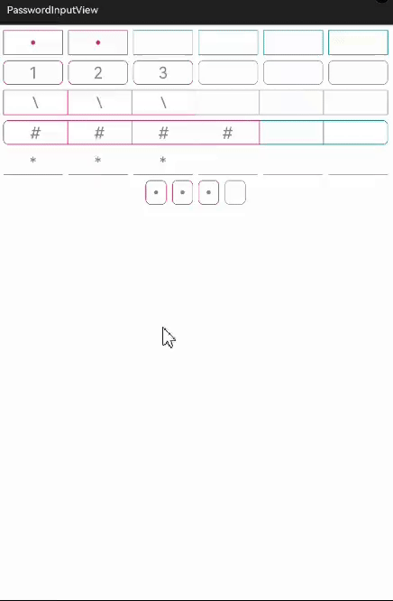

# PasswordInputView
A HMOS library of custom password (verification code) input box that supports multiple styles.

# Source
Inspired by [yu1tiao/PasswordInputView](https://github.com/yu1tiao/PasswordInputView)

## Features
1) This library can display plaintext or ciphertext, ciphertext supports displaying dots, asterisks, or any characters.
2) The user can set the color of the border of the input box and password.
3) The color of the input box changes after providing input.
4) The user can set the password style as asterisk, plaintext and circle.
5) The user can set the border style line and box.
6) The user can set the maximum length of the password.
7) You can set the interval and rounded corners between the password boxes.
8) You can configure the radius for the input boxes.



## Dependency
1. For using passwordinputview module in sample app, include the source code and add the below dependencies in entry/build.gradle to generate hap/support.har.
```groovy
dependencies {
    implementation fileTree(dir: 'libs', include: ['*.jar', '*.har'])
    testImplementation 'junit:junit:4.13.1'
    implementation project(path: ':passwordinputview')
    ohosTestImplementation 'com.huawei.ohos.testkit:runner:1.0.0.200'
}
```

2. For using passwordinputview in separate application using har file, add the har file in the entry/libs folder and add the dependencies in entry/build.gradle file.
```groovy
dependencies {
    implementation fileTree(dir: 'libs', include: ['*.har'])
    testImplementation 'junit:junit:4.13'
}
```

## Usage
#### Include following code in your layout:
```xml
    <com.matthew.passwordinput.lib.PasswordInputView
         ohos:id="$+id:passwordView"
         ohos:width="match_parent"
         ohos:height="50vp"
         ohos:top_margin="10vp"
         ohos:text_input_type="pattern_number"
         ohos:padding="1vp"
         ohos:text="12"
         ohos:text_size="32fp"
         app:layout_constraintLeft_toLeftOf="parent"
         app:layout_constraintRight_toRightOf="parent"
         app:layout_constraintTop_toTopOf="parent"
         app:pwv_borderColor="$color:colorPrimary"
         app:pwv_haveInputBorderColor="$color:colorAccent"
         app:pwv_pwdColor="$color:colorAccent"
         app:pwv_pwdStyle="plaintext"
         app:pwv_radius="10vp"
         app:pwv_borderStyle="line"
         app:pwv_maxLength="4"
         app:pwv_spacing="12vp" />
```
Attribute | Description
--- | ---
`maxLength` | Maximum length of the password for the `PasswordInputView`
`borderColor` | Border color of the password input box for the `PasswordInputView`
`pwdColor` | Color of the password for the `PasswordInputView`
`inputBorderColor` | Border color of the password input box after the input for the `PasswordInputView`
`asterisk` | Display of ciphertext as dots, asterisks, or any characters for the `PasswordInputView`
`radius` | Radius of the password input box for the `PasswordInputView`
`spacing` | Spacing between the input box of the password for the `PasswordInputView`
`borderStyle` | Border style of the input box for the `PasswordInputView`
`pwdStyle` | Password style for the `PasswordInputView`

#### Set up the listener:
```java
      passwordView.setInputListener(new PasswordInputView.InputListener() {
          @Override
          public void onInputCompleted(String text) {
              // Call back after input is complete
          }
      });
```